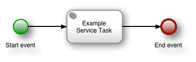
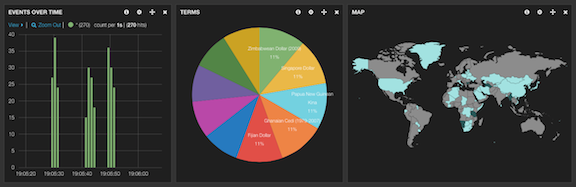

# Business process visibility with ALEK

This sample application demonstrates generic business process visibility using the ALEK stack (Activiti, logstash,
Elasticsearch and Kibana).

This application provides visibility for a trivial business process:

## Running the example

Use`sbt run` to run the example.

## How it works

The application consists of a minimal amount of code that performs the following steps.

1. The `Main` class is the entry point, which starts the Activiti engine using an in-memory H2 database and deploys the
   business process from an XML definition.
2. `Main` then executes the deployed process a few times with random data in process variables.
3. `LoggingEventListener` is an Activiti event listener that logs the current process variables each time an activity
   (process node) is activated.
4. `logback.xml` configures [logback](http://logback.qos.ch) to write a log file.
5. `logstash.conf` configures logstash to parse the resulting log file and insert process logging into ElasticSearch.
6. Kibana’s default logstash dashboard displays the results.

## Example output

The log file output uses `application` and `process` loggers, and produces the following output.

	2014-03-24 18:30:54,615 INFO application Main
	2014-03-24 18:30:56,935 INFO application Deploy business process
	2014-03-24 18:30:57,494 INFO application Execute business processes
	2014-03-24 18:30:57,609 INFO process.logging-test:19:1903 execution=1904 number=526 country=BD currency='Solomon Islands Dollar' activity=start
	2014-03-24 18:30:57,610 INFO process.logging-test:19:1903 execution=1904 number=526 country=BD currency='Solomon Islands Dollar' activity=example-task
	2014-03-24 18:30:57,614 INFO process.logging-test:19:1903 execution=1904 number=526 country=BD currency='Solomon Islands Dollar' activity=end
	2014-03-24 18:30:57,732 INFO process.logging-test:19:1903 execution=1911 number=694 country=HN currency='New Taiwan Dollar' activity=start
	2014-03-24 18:30:57,732 INFO process.logging-test:19:1903 execution=1911 number=694 country=HN currency='New Taiwan Dollar' activity=example-task
	2014-03-24 18:30:57,733 INFO process.logging-test:19:1903 execution=1911 number=694 country=HN currency='New Taiwan Dollar' activity=end
	2014-03-24 18:30:57,853 INFO process.logging-test:19:1903 execution=1918 number=951 country=MM currency='Testing Currency Code' activity=start
	2014-03-24 18:30:57,854 INFO process.logging-test:19:1903 execution=1918 number=951 country=MM currency='Testing Currency Code' activity=example-task
	2014-03-24 18:30:57,854 INFO process.logging-test:19:1903 execution=1918 number=951 country=MM currency='Testing Currency Code' activity=end
	2014-03-24 18:30:57,884 INFO application Done

The `process` logger category includes the business process definition ID, which is useful if you have multiple business
processes. Each `process` log message consists of key-value pairs for the process variables, plus additional `execution`
(process execution ID) and `activity` (process node ID) values.

The logstash configuration ignores all but the `process` log statements, parses the key-value pairs into ‘facets’ and
inserts a ‘document’ into Elasticsearch for each log statement. For example:

	{
	       "message" => "2014-03-24 18:39:18,083 INFO process.logging-test:20:2003 execution=2011 number=213 country=GD currency='Turkish Lira' activity=example-task",
	      "@version" => "1",
	    "@timestamp" => "2014-03-24T18:39:18.083+01:00",
	          "host" => "flowers",
	          "path" => "/Users/pedro/Documents/code/lunatech/activiti-logstash/process.log",
	         "level" => "INFO",
	        "logger" => "process.logging-test:20:2003",
	     "execution" => "2011",
	        "number" => "213",
	       "country" => "GD",
	      "currency" => "Turkish Lira",
	      "activity" => "example-task"
	}

You can then modify Kibana’s default logstash dashboard by adding panels that show values for the various facets.

In this example the first panel shows a timeline of log events, grouped into one-second intervals, a pie chart of
currencies and a map of countries.
